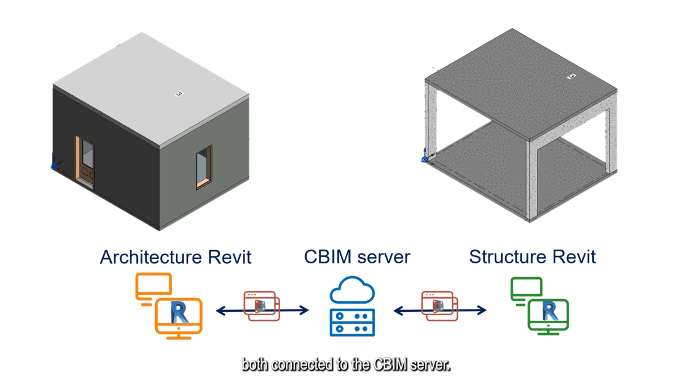

# Graph-based inter-domain consistency maintenance for BIM models

[Zijian Wang](https://www.linkedin.com/in/wang-zijian/), [Boyuan Ouyang](https://www.linkedin.com/in/boyuan-ouyang/), [Prof. Rafael Sacks](https://www.linkedin.com/in/rafaelsacks/)  
[VClab, Technion](https://sacks.net.technion.ac.il/)

[Paper](https://doi.org/10.1016/j.autcon.2023.104979) | [Video](https://youtu.be/ucsJOsbhB_M) | [Code](https://github.com/your-repo)

## Overview

Even with modern BIM software, design collaboration across disciplines for building construction remains sequential and siloed. Cloud-based BIM (CBIM) proposes an alternative approach, in which BIM models are stored as discipline-specific graphs whose nodes are linked to support across-domain coordination.



## Key Contributions

- Defined constraint classes to relate objects across disciplines
- Devised a mechanism to resolve conflicts
- Implemented a case study prototype with federated building models
- Demonstrated system's response to design changes across disciplines

## Prototype Demonstration

<video width="100%" controls style="max-width: 800px; display: block; margin: 2rem auto;">
  <source src="https://youtu.be/ucsJOsbhB_M" type="video/mp4">
  Your browser does not support the video tag.
</video>

## Related Work

We are persistently delving into the potential of representing BIM models as graphs, and firmly believe that BIM graphs can enable more advanced and intelligent applications in the future.

- [First CBIM position paper](https://doi.org/10.1016/j.aei.2022.101711)
- [Graph-based data structure](https://cbim2020.net.technion.ac.il/files/2022/09/2022ECPPM_SE_Assoc_Ouyang_etal-28.9.22.pdf)
- [Semantic enrichment for interoperability](https://arxiv.org/abs/2304.11672)
- [GNN for BIM graphs](https://doi.org/10.1016/j.autcon.2021.104039)

## Citation

```bibtex
@article{WANG2023104979,
    title = {Graph-based inter-domain consistency maintenance for BIM models},
    journal = {Automation in Construction},
    volume = {154},
    pages = {104979},
    year = {2023},
    issn = {0926-5805},
    doi = {https://doi.org/10.1016/j.autcon.2023.104979},
    author = {Zijian Wang and Boyuan Ouyang and Rafael Sacks}
}
```

## Acknowledgement

The work is part of the Cloud-based Building Information Modelling (CBIM) project, a European Training Network. The CBIM project receives funding from the European Union's Horizon 2020 research and innovation programme under the Marie Skłodowska-Curie grant with agreement No 860555.