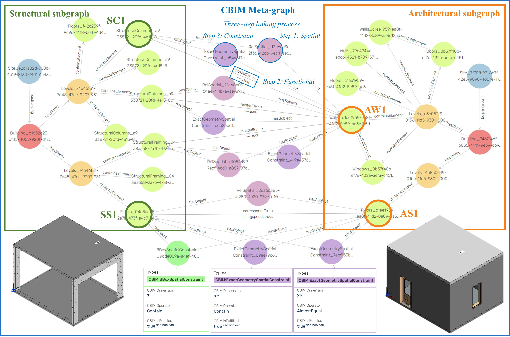

BIM model types of applications...

Even with modern BIM software, design collaboration across disciplines for building construction remains sequential and siloed. Cloud-based BIM (CBIM) proposes an alternative approach, in which BIM models are stored as discipline-specific graphs whose nodes are linked to support across-domain coordination. This work presents a theoretical basis for systematic consistency maintenance by 1) defining constraint classes to relate objects across disciplines and 2) devising a mechanism to resolve conflicts. A case study prototype was implemented with federated building models to demonstrate the system's response to design changes made by one discipline that impact others. It detects conflicts that violate design intent, and in simple cases, such as translations, it can resolve inconsistencies by actively propagating corrections subject to users' approvals. The prototype demonstrates the feasibility of the approach and strengthens the growing understanding that linked graphs with meaningful relationships can open the door to intelligent applications across BIM disciplines.

Even with modern BIM software, design collaboration across disciplines for building construction remains sequential and siloed. Cloud-based BIM (CBIM) proposes an alternative approach, in which BIM models are stored as discipline-specific graphs whose nodes are linked to support across-domain coordination. This work presents a theoretical basis for systematic consistency maintenance by 1) defining constraint classes to relate objects across disciplines and 2) devising a mechanism to resolve conflicts. A case study prototype was implemented with federated building models to demonstrate the system's response to design changes made by one discipline that impact others. It detects conflicts that violate design intent, and in simple cases, such as translations, it can resolve inconsistencies by actively propagating corrections subject to users' approvals. The prototype demonstrates the feasibility of the approach and strengthens the growing understanding that linked graphs with meaningful relationships can open the door to intelligent applications across BIM disciplines.

Even with modern BIM software, design collaboration across disciplines for building construction remains sequential and siloed. Cloud-based BIM (CBIM) proposes an alternative approach, in which BIM models are stored as discipline-specific graphs whose nodes are linked to support across-domain coordination. This work presents a theoretical basis for systematic consistency maintenance by 1) defining constraint classes to relate objects across disciplines and 2) devising a mechanism to resolve conflicts. A case study prototype was implemented with federated building models to demonstrate the system's response to design changes made by one discipline that impact others. It detects conflicts that violate design intent, and in simple cases, such as translations, it can resolve inconsistencies by actively propagating corrections subject to users' approvals. The prototype demonstrates the feasibility of the approach and strengthens the growing understanding that linked graphs with meaningful relationships can open the door to intelligent applications across BIM disciplines.

