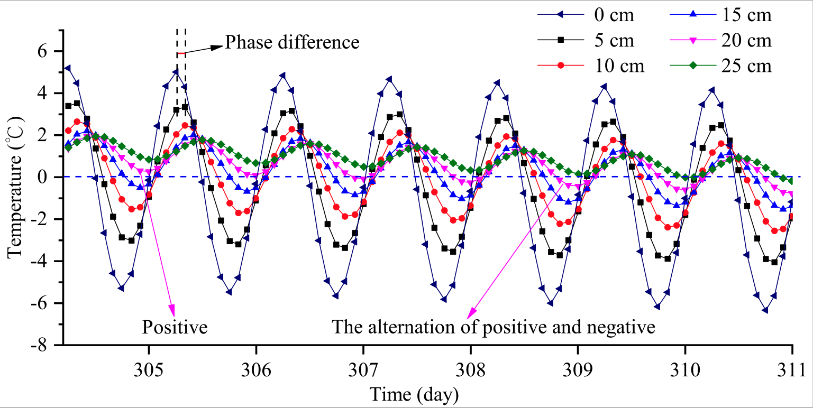
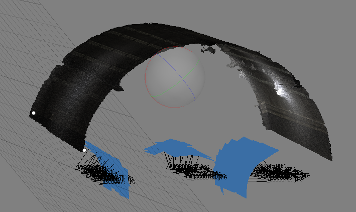

### Ph.D. Project: Graph Representation of BIM models

**5. Z Wang**, T Yeung, R Sacks, Z Su (2021). Room Type Classification for Semantic Enrichment of Building Information Modeling Using Graph Neural Networks. *Proceedings of the 38th International Conference of CIB W78, Luxembourg, 13-15 October, pp 773-781* (ISSN: 2706-6568). [Paper link](http://itc.scix.net/paper/w78-2021-paper-077)

 
Using graph neural networks to classify room types of BIM graphs for semantic enrichment

### Graduate Project: Personal Protective Equipment (PPE) Detection

**4.** 
**Zijian, W.**, Wu, Y., Yang, L., Thirunavukarasu, A., Evison, C., & Zhao, Y., 2021. Fast Personal Protective Equipment Detection for Real Construction Sites Using Deep Learning Approaches. *Sensors*, 21(10), 3478. [Paper link](https://doi.org/10.3390/s21103478), [Dataset in Github](https://github.com/ZijianWang1995/PPE_detection)

 
Using deep leanring models to detect multi PPE classes with high accuracy and efficiency

***
***
***

### Graduate Project: Temperature Distribution in Cold-region Tunnels

**3.** Peng, X., Yimin, W., **Zijian, W.\*** and Le, H., 2020. Distribution laws of freeze-thaw cycles and unsaturated concrete experiments in cold-region tunnels. *Cold Regions Science and Technology*, 172, p.102985. [Paper link](https://doi.org/10.1016/j.coldregions.2019.102985)

**2.**  Wu, Y., Xu, P., Li, W., **Zijian, W.**, Cai, Z. and Shao, S., 2020. Distribution rules and key features for the lining surface temperature of road tunnels in cold regions. *Cold regions science and technology*, 172, p.102979. [Paper link](https://doi.org/10.1016/j.coldregions.2019.102979) 

 
Revealed the distribution laws of freeze-thaw cycles of tunnels by data mining

***
***
***

### Udergraduate Project: Tunnel 3D Reconstruction
**1.** **Zijian W.**, Hongfei M., Yidan X., Qiupeng Y., Jiayan Z\*., 2018. The method of tunnel 3D reconstruction basing on changeable photography. *Science of Surveying and Mapping (in Chinese)*. 06, 72-77. [Paper link](https://kns.cnki.net/KCMS/detail/detail.aspx?dbcode=CJFQ&dbname=CJFDLAST2018&filename=CHKD201806012&v=MjcxNjJDVVI3cWZadVJ1Rml6aFVMdkpKaVhBYXJHNEg5bk1xWTlFWm9SOGVYMUx1eFlTN0RoMVQzcVRyV00xRnI=)

  
Measured the distances of two points in tunnel reconstructed 3D images

